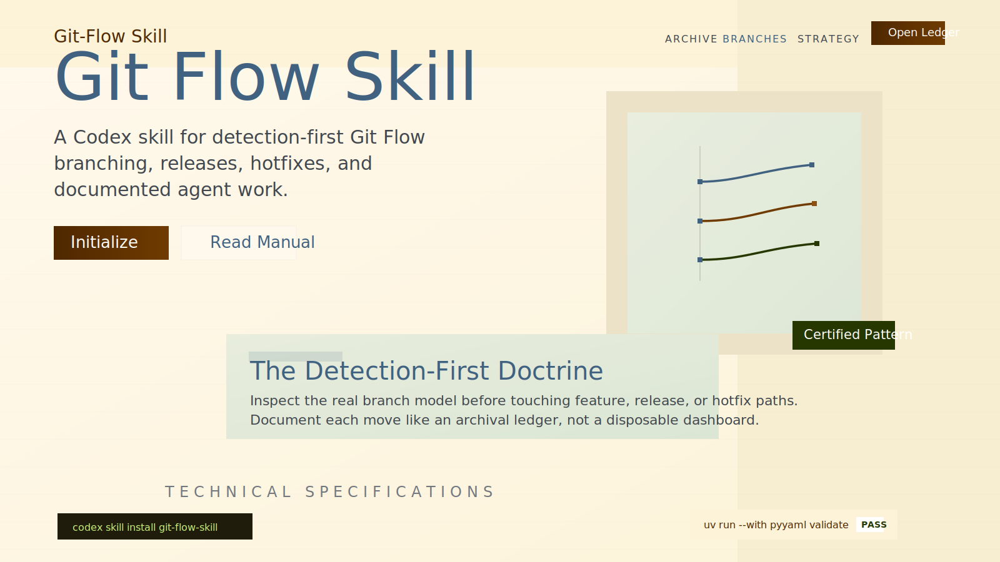

<p align="center">
  
</p>

<p align="center">
  <a href="./README.md">English</a>
  |
  <a href="./README.ja.md"><strong>日本語</strong></a>
</p>

<p align="center">
  <a href="https://github.com/Sunwood-ai-labs/git-flow-skill/actions/workflows/validate.yml"></a>
  
  
</p>

<p align="center">
  リポジトリの実際の branch model を先に検出し、その上で安全に Git Flow を運用するための Codex skill です。
</p>

## 概要

`git-flow-skill` は、Git Flow そのものを決め打ちせず、まずリポジトリの実際の運用を確認してから `feature`、`release`、`hotfix`、recovery のどれを使うべきか判断します。`main` と `develop` がある標準的な Git Flow はもちろん、そこに近い派生運用にも対応しやすい構成です。

あわせて、新しいリポジトリに `develop` を安全に生やすための PowerShell 初期化スクリプトも同梱しています。

## 特徴

- リポジトリの実 branch model を確認してから Git Flow を適用
- `feature/*`、`release/*`、`hotfix/*`、`codex/feature/*` まで扱える
- `develop` 作成と `gitflow.*` 設定に使える `init-git-flow.ps1` を同梱
- plain `git`、`git flow` CLI、PR 前提運用、復旧手順を playbook 化
- CI で skill 検証と Windows 上の初期化 smoke test を実施

## 導入

1. このリポジトリを clone するか、`git-flow-skill` フォルダごと Codex の skills ディレクトリへ配置します。
2. フォルダ名は `git-flow-skill` のままにします。
3. Codex から次のように呼び出します。

```text
Use $git-flow-skill to initialize this repository for Git Flow and create develop safely.
Use $git-flow-skill to start a feature branch for PROJ-142 from develop.
Use $git-flow-skill to finish a release branch and merge it back to main and develop.
```

## 使い方の例

- `Use $git-flow-skill to detect whether this repo really uses Git Flow before touching branches.`
- `Use $git-flow-skill to initialize develop and configure gitflow prefixes in this repository.`
- `Use $git-flow-skill to create a codex/feature branch for a repository polish task.`
- `Use $git-flow-skill to repair a hotfix that reached main but never got back-merged into develop.`
- `Use $git-flow-skill to finish a release with plain git because git-flow CLI is not installed.`

## Branch 戦略

- `main` は常に安定版
- `develop` は継続開発の統合先
- `feature/<ticket>-<slug>` は標準的な feature branch
- `codex/feature/<slug>` はエージェント作業を見分けやすくしたい時の派生形
- `release/<version>` は `develop` から切る出荷準備用 branch
- `hotfix/<version>` は `main` から切り、最後に `main` と `develop` の両方へ戻す

## 同梱ファイル

| Path | 役割 |
| --- | --- |
| [`SKILL.md`](./SKILL.md) | skill 本体。trigger、ガードレール、branch 判断ロジック |
| [`references/gitflow-playbook.md`](./references/gitflow-playbook.md) | plain `git` の手順、復旧パターン、release/hotfix の finish checklist |
| [`scripts/init-git-flow.ps1`](./scripts/init-git-flow.ps1) | `develop` 作成、remote push、`gitflow.*` 設定を行う初期化 helper |
| [`scripts/validate-skill.py`](./scripts/validate-skill.py) | `SKILL.md` と `agents/openai.yaml` を検証する self-contained validator |
| [`.github/workflows/validate.yml`](./.github/workflows/validate.yml) | CI 検証と Windows smoke test |
| [`agents/openai.yaml`](./agents/openai.yaml) | Codex UI 向け metadata、brand color、icon 定義 |

## ローカル検証

CI と同じ検証はローカルでも実行できます。

```powershell
uv run --with pyyaml python .\scripts\validate-skill.py .
powershell -ExecutionPolicy Bypass -File .\scripts\init-git-flow.ps1 -ConfigureGitFlow
```

初期化スクリプトは本番 repo でいきなり試すより、テンポラリのテスト repo で smoke test してから使うのが安全です。

## デザイン方針

見た目は、Git Flow を「台帳の上で整理された branch 図」として見せる parchment-ledger 系の配色です。紫グラデやテンプレ的なテックブルーではなく、`Parchment`、`Ink Blue`、`Moss Ledger`、`Copper Merge`、`Paper` を軸にしています。

GitHub Markdown 上でも読みやすく、道具感がありつつ、他の skill repo と見分けやすいことを狙っています。

## ライセンス

このリポジトリは [MIT License](./LICENSE) で公開しています。
